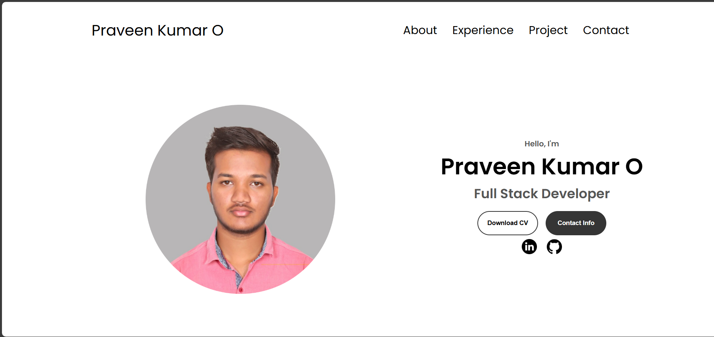
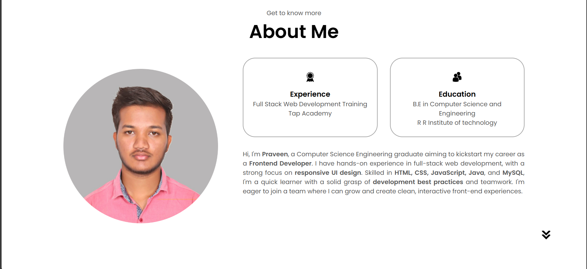
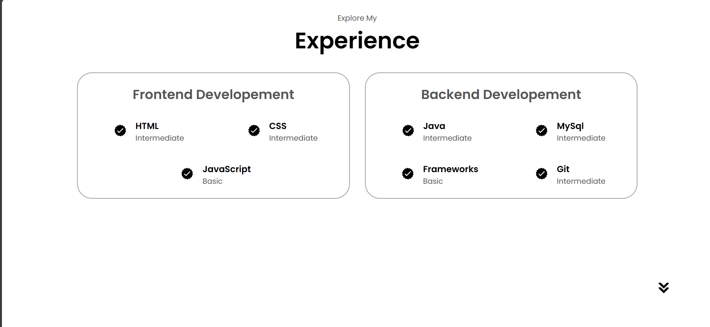
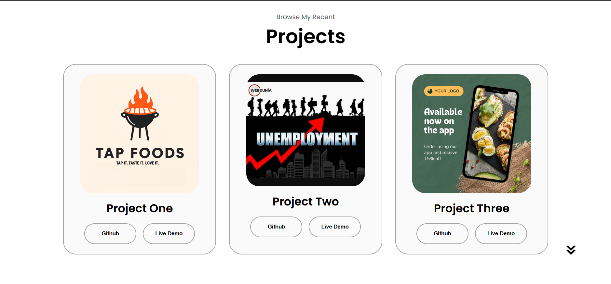
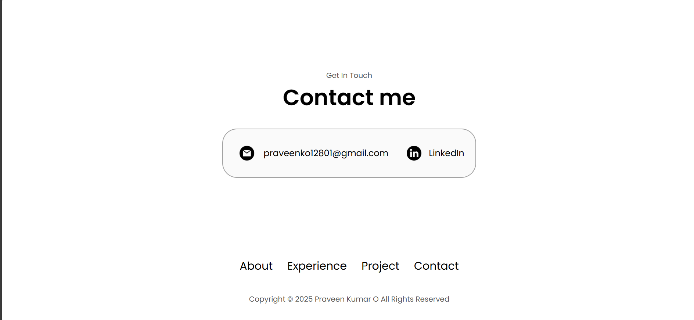

# 💼 Praveen Kumar's Portfolio

Welcome to my personal portfolio website! This site highlights my skills, projects, and professional background. It's built with core web technologies and designed to be responsive across all devices.

## 🌐 Live Demo

🔗 [Visit Portfolio](https://praveen12801.github.io/my-portfolio/)

## 📸 Screenshots

<!-- Make sure to add these screenshots to a folder like `assets/screenshots/` -->
### 🏠 Homepage

### 🙋‍♂️ About

### 💼 Experience

### 🛠️ Projects

### 📬 Contact

## 🛠️ Tech Stack

- **HTML**
- **CSS**
- **JavaScript**

## 🚀 Deployment

This portfolio is deployed using **GitHub Pages**.

## 📁 Folder Structure
my-portfolio/
├── index.html
├── style.css
├── script.js
├── assets/
│ └── screenshots/
│ ├── homepage.png
│ ├── about.png
│ ├── experience.png
│ ├── projects.png
│ └── contact.png
└── README.md

## ✨ Features

- ✅ Responsive design
- ✅ Project showcase with links
- ✅ Resume download
- ✅ Contact form

## 🧠 What I Learned

- Strengthened my HTML, CSS, and JavaScript fundamentals
- Gained experience in designing responsive layouts
- Learned to host static websites using GitHub Pages
- Improved UI/UX thinking and design consistency

## 📬 Contact Me

- 📧 Email: praveenko12801@gmail.com  
- 🔗 [LinkedIn](https://www.linkedin.com/in/praveen-kumar-o-178523254/)  
- 💻 [GitHub](https://github.com/Praveen12801)

## 📄 License

This project is licensed under the MIT License - see the [LICENSE](LICENSE) file for details.

